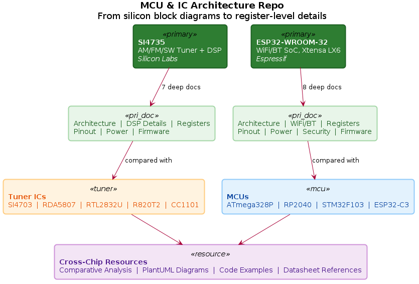

# MCU & IC Architecture Repo

> Mapping the internal architecture of popular microcontrollers and radio ICs — from silicon block diagrams to register-level details.

**Status**: Planning & Initial Documentation  
**License**: MIT

---

## Purpose

A detailed, hands-on reference for understanding the internal structure of popular MCUs and ICs used in embedded systems, radio, and wireless communications. Primary focus on the **SI4735** (AM/FM/SW tuner with DSP) and **ESP32** (WiFi/Bluetooth SoC), with secondary coverage of related chips for comparison.

## Repo Coverage Map



> PlantUML source: [`diagrams/repo_overview.puml`](diagrams/repo_overview.puml)

---

## Target Semiconductors

### Primary Focus (Deep Documentation)

| Chip | Manufacturer | Type | Core | Key Feature |
|------|-------------|------|------|-------------|
| [**SI4735**](docs/SI4735/overview.md) | Silicon Labs | AM/FM/SW/LW Tuner IC | DSP core | Digital radio with programmable DSP, I2C/SPI control |
| [**ESP32-WROOM-32**](docs/ESP32/overview.md) | Espressif | WiFi/BT SoC | Xtensa LX6 (dual-core) | WiFi + Bluetooth + rich peripherals |

### Secondary — Radio/Tuner ICs

| Chip | Manufacturer | Type | DSP? | Interface | Notes |
|------|-------------|------|------|-----------|-------|
| [SI4703](docs/tuners/SI4703/overview.md) | Silicon Labs | FM Tuner | No | I2C | Good contrast with SI4735 (no DSP) |
| [RDA5807](docs/tuners/RDA5807/overview.md) | RDA Micro | FM Tuner | No | I2C | Cheapest FM tuner, widely available |
| [RTL2832U](docs/tuners/RTL2832U/overview.md) | Realtek | DVB-T / SDR Demod | Yes | USB | The SDR dongle chip |
| [R820T2](docs/tuners/R820T2/overview.md) | Rafael Micro | RF Tuner | No | I2C (via RTL2832U) | Analog front-end paired with RTL2832U |
| [CC1101](docs/tuners/CC1101/overview.md) | Texas Instruments | Sub-GHz Transceiver | No | SPI | 315/433/868/915 MHz, entry-level |

### Secondary — MCUs

| Chip | Manufacturer | Core | Key Feature | Notes |
|------|-------------|------|-------------|-------|
| [ATmega328P](docs/mcus/ATmega328P/overview.md) | Microchip/Atmel | 8-bit AVR | Arduino Uno/Nano chip | Entry-level, 16 MHz |
| [RP2040](docs/mcus/RP2040/overview.md) | Raspberry Pi | Dual ARM Cortex-M0+ | PIO state machines | Used in Pi Pico |
| [STM32F103](docs/mcus/STM32F103/overview.md) | STMicroelectronics | ARM Cortex-M3 | "Blue Pill" board | Entry-level ARM, 72 MHz |
| [ESP32-C3](docs/mcus/ESP32_C3/overview.md) | Espressif | RISC-V (single-core) | WiFi + BLE | Architectural contrast with ESP32 |

---

## Project Structure

```
MCU_IC_Architecture_Repo/
├── docs/
│   ├── SI4735/                    ← PRIMARY
│   │   ├── overview.md
│   │   ├── architecture.md
│   │   ├── dsp_details.md
│   │   ├── pinout.md
│   │   ├── registers.md
│   │   ├── power.md
│   │   ├── firmware.md
│   │   ├── examples/
│   │   ├── diagrams/
│   │   └── benchmarks/
│   ├── ESP32/                     ← PRIMARY
│   │   ├── overview.md
│   │   ├── architecture.md
│   │   ├── wifi_bluetooth.md
│   │   ├── pinout.md
│   │   ├── registers.md
│   │   ├── power.md
│   │   ├── security.md
│   │   ├── firmware.md
│   │   ├── examples/
│   │   ├── diagrams/
│   │   └── benchmarks/
│   ├── tuners/                    ← SECONDARY
│   │   ├── SI4703/
│   │   ├── RDA5807/
│   │   ├── RTL2832U/
│   │   ├── R820T2/
│   │   └── CC1101/
│   └── mcus/                      ← SECONDARY
│       ├── ATmega328P/
│       ├── RP2040/
│       ├── STM32F103/
│       └── ESP32_C3/
├── diagrams/                      ← Shared Draw.io / Mermaid sources
├── examples/                      ← Cross-chip code samples
├── references/                    ← Datasheet links, research papers
├── analysis/                      ← Comparative studies, scripts
├── tools/                         ← Dev tools, IDEs, debugger configs
├── README.md
├── requirements.md
└── LICENSE
```

---

## Documentation Depth

### For Primary Chips (SI4735, ESP32)

1. **Core Architecture** — Processor/DSP type, clock tree, memory layout (SRAM, Flash, ROM), bus architecture
2. **Advanced Internals** — DSP algorithms and filters (SI4735), Xtensa LX6 pipeline and co-processors (ESP32), RF front-ends, PHY/MAC layers
3. **Pinout & Interfaces** — Pin multiplexing, electrical specs, protocol stacks (I2C, SPI, UART, ADC)
4. **Register Maps** — Complete register descriptions with bit-level fields, reset values, access types
5. **Power Management** — Sleep modes, power domains, low-power techniques, consumption measurements
6. **Security & Firmware** — Secure boot (ESP32), OTA updates, firmware patching, boot sequence
7. **Code Examples** — Working examples: custom DSP filters, WiFi connections, Bluetooth pairing, sensor reads
8. **Benchmarks** — Power consumption graphs, throughput measurements, comparison with similar ICs

### For Secondary Chips

Lighter coverage: overview, block diagram, pinout, key registers, and one or two code examples per chip.

---

## Getting Started

### Prerequisites

- Git
- A text editor or IDE (VS Code recommended)
- [Draw.io](https://app.diagrams.net/) or VS Code Draw.io extension for diagrams
- GCC ARM toolchain, ESP-IDF, or Arduino IDE (depending on chip)

### Navigate the Repo

1. Start with a chip's `overview.md` for high-level understanding
2. Read `architecture.md` for the internal block diagram
3. Dive into specific files (`registers.md`, `power.md`, etc.) as needed
4. Run examples from the `examples/` subfolder

---

## Key Datasheet References

| Chip | Datasheet |
|------|-----------|
| SI4735 | [Silicon Labs SI4735 Programming Guide (AN332)](https://www.silabs.com/documents/public/application-notes/AN332.pdf) |
| ESP32 | [ESP32 Technical Reference Manual](https://www.espressif.com/sites/default/files/documentation/esp32_technical_reference_manual_en.pdf) |
| ATmega328P | [Microchip ATmega328P Datasheet](https://ww1.microchip.com/downloads/en/DeviceDoc/ATmega48A-PA-88A-PA-168A-PA-328-P-DS-DS40002061B.pdf) |
| RP2040 | [RP2040 Datasheet](https://datasheets.raspberrypi.com/rp2040/rp2040-datasheet.pdf) |
| STM32F103 | [STM32F103 Reference Manual](https://www.st.com/resource/en/reference_manual/rm0008-stm32f101xx-stm32f102xx-stm32f103xx-stm32f105xx-and-stm32f107xx-advanced-armbased-32bit-mcus-stmicroelectronics.pdf) |
| RTL2832U | [RTL2832U Datasheet](https://www.realtek.com/en/products/communications-network-ics/item/rtl2832u) |

---

## Diagram Tooling

All diagrams use one of:
- **PlantUML** (`.puml` files) — architecture block diagrams, signal flows, state machines, comparisons
- **ASCII art** (inline in Markdown) — simple register fields, pin tables, quick sketches
- **PNG exports** — generated from `.puml` sources, committed alongside for quick viewing on GitHub

Generate PNGs from PlantUML:
```bash
# Single file
plantuml -tpng diagrams/repo_overview.puml

# All diagrams recursively
find . -name '*.puml' -exec plantuml -tpng {} \;
```

Requires: Java runtime + [PlantUML](https://plantuml.com/) (`sudo apt install plantuml` on Debian/Ubuntu).

---

## Roadmap

- [x] Define target semiconductors
- [x] Define project structure and documentation depth
- [x] SI4735 — overview, architecture, DSP details, pinout, registers, power, firmware
- [x] ESP32 — overview, architecture, WiFi/BT internals, security, firmware
- [x] Secondary tuner ICs — SI4703, RDA5807, RTL2832U, R820T2, CC1101
- [x] Secondary MCUs — ATmega328P, RP2040, STM32F103, ESP32-C3
- [x] PlantUML diagrams (13 architecture/signal-flow/pinout/comparison diagrams)
- [ ] Comparative analysis write-ups (SI4735 vs SI4703 vs RDA5807)
- [ ] Cross-chip code examples and benchmarks
- [ ] Complete register maps for all primary chips

---

## Contributing

Contributions welcome! To contribute:

1. Fork the repo
2. Create a branch (`git checkout -b add-chip-xyz`)
3. Follow the documentation structure in `/docs/`
4. Ensure all claims reference official datasheets
5. Submit a pull request

---

## License

This project is licensed under the MIT License — see [LICENSE](LICENSE) for details.