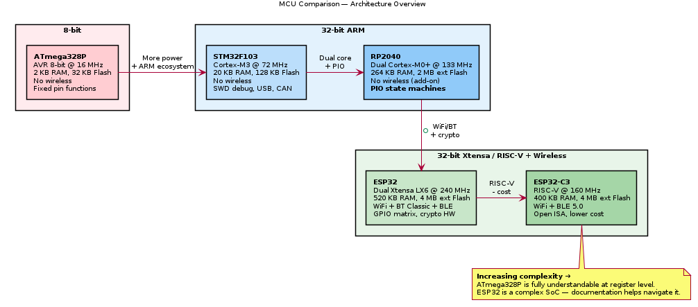

# Analysis

Comparative studies, benchmarks, and performance analysis across chips.

## Chip Comparison Overview

> PlantUML source: [chip_comparison.puml](chip_comparison.puml)

## Planned Comparisons

- SI4735 vs SI4703 vs RDA5807 (tuner ICs: DSP vs no-DSP)
- ESP32 vs ESP32-C3 (Xtensa vs RISC-V)
- ESP32 vs STM32F103 vs ATmega328P vs RP2040 (MCU tiers)
- RTL2832U+R820T2 vs SI4735 (software SDR vs hardware DSP)
