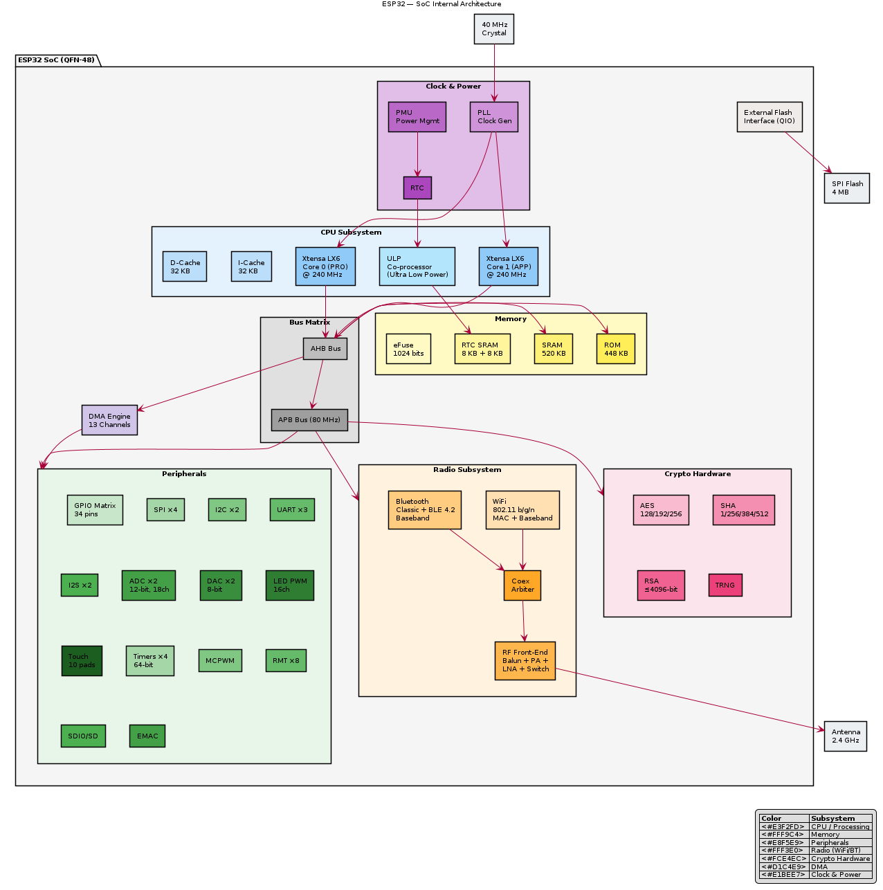

# ESP32 — Architecture

## High-Level Block Diagram

```
┌─────────────────────────────────────────────────────────────────────────┐
│                           ESP32 SoC                                     │
│                                                                         │
│  ┌──────────────┐   ┌──────────────┐   ┌──────────────────────────┐    │
│  │ Xtensa LX6   │   │ Xtensa LX6   │   │    ULP Co-processor      │    │
│  │  Core 0      │   │  Core 1      │   │  (Ultra Low Power)       │    │
│  │  @ 240 MHz   │   │  @ 240 MHz   │   │  FSM + RISC-V (v4.x)    │    │
│  └──────┬───────┘   └──────┬───────┘   └──────────┬───────────────┘    │
│         │                  │                       │                    │
│         └──────────┬───────┘                       │                    │
│                    ▼                               │                    │
│         ┌──────────────────┐                       │                    │
│         │   CPU Bus (AHB)  │◄──────────────────────┘                    │
│         └────────┬─────────┘                                            │
│                  │                                                      │
│    ┌─────────────┼──────────────┬──────────────┬──────────────┐        │
│    ▼             ▼              ▼              ▼              ▼        │
│ ┌──────┐  ┌──────────┐  ┌──────────┐  ┌──────────┐  ┌──────────┐    │
│ │ ROM  │  │  SRAM    │  │  DMA     │  │  Crypto  │  │ Periph   │    │
│ │448KB │  │  520KB   │  │ 13 ch    │  │  Engine  │  │  Matrix  │    │
│ └──────┘  └──────────┘  └──────────┘  │AES/SHA/  │  └────┬─────┘    │
│                                        │RSA/ECC   │       │          │
│                                        └──────────┘       │          │
│    ┌──────────────────────────────────────────────────────┘          │
│    │                                                                 │
│    ▼                                                                 │
│  ┌────────────────────────────────────────────────────────────┐     │
│  │                    Peripheral Bus (APB)                     │     │
│  ├──────┬──────┬──────┬──────┬──────┬──────┬──────┬──────────┤     │
│  │ GPIO │ SPI  │ I2C  │ UART │ I2S  │ ADC  │ DAC  │ Timers   │     │
│  │  34  │  4   │  2   │  3   │  2   │ 2×12 │ 2×8  │ 4 × 64b  │     │
│  │ pins │      │      │      │      │ bit  │ bit  │          │     │
│  ├──────┴──────┼──────┼──────┼──────┴──────┴──────┼──────────┤     │
│  │ Touch (10)  │ PWM  │ MCPWM│ SD/SDIO  │ EMAC   │ RMT      │     │
│  │             │ 16ch │      │          │        │ 8ch      │     │
│  └─────────────┴──────┴──────┴──────────┴────────┴──────────┘     │
│                                                                     │
│  ┌─────────────────────────────────────────────────────────────┐   │
│  │                    Radio Subsystem                           │   │
│  │  ┌──────────────┐  ┌──────────────┐  ┌──────────────────┐  │   │
│  │  │ WiFi         │  │ Bluetooth    │  │ RF Front-End     │  │   │
│  │  │ 802.11 b/g/n │  │ Classic+BLE  │  │ Balun + PA + LNA │  │   │
│  │  │ MAC + BB     │  │ 4.2          │  │ Switch           │  │   │
│  │  └──────────────┘  └──────────────┘  └──────────────────┘  │   │
│  └─────────────────────────────────────────────────────────────┘   │
│                                                                     │
│  ┌────────────┐  ┌────────────┐  ┌──────────────────────────────┐  │
│  │ Clock Gen  │  │ Power Mgmt │  │ SPI Flash Interface (QIO)    │  │
│  │ PLL + XTAL │  │ RTC + PMU  │  │ → External 4MB Flash         │  │
│  └────────────┘  └────────────┘  └──────────────────────────────┘  │
└─────────────────────────────────────────────────────────────────────────┘
```

## Internal Components

### 1. Xtensa LX6 Dual-Core CPU
- Two Xtensa LX6 32-bit cores (PRO_CPU and APP_CPU)
- 7-stage pipeline
- Up to 240 MHz clock (configurable per-core)
- 32 KB instruction cache, 32 KB data cache per core
- Hardware multiply/divide, single-cycle 32×32 MAC
- Supports symmetric multiprocessing (SMP) via FreeRTOS

### 2. ULP Co-processor
- Ultra Low Power co-processor for deep-sleep tasks
- FSM-based (original ESP32) with limited instruction set
- Can access GPIO, ADC, I2C, RTC memory while main cores sleep
- RTC memory (8 KB) persists across deep sleep
- Power consumption: ~150 µA during ULP operation

### 3. Memory Subsystem
- **Internal ROM**: 448 KB (bootloader, crypto libraries)
- **Internal SRAM**: 520 KB (split into SRAM0: 192 KB, SRAM1: 128 KB, SRAM2: 200 KB)
- **RTC SRAM**: 8 KB (persists in deep sleep)
- **External Flash**: Via SPI (up to 16 MB, QIO mode)
- **External PSRAM**: Optional (up to 8 MB via SPI)
- **eFuse**: 1024 bits (MAC address, security config, calibration)

### 4. Bus Architecture
- **AHB (Advanced High-performance Bus)**: Connects CPUs to memory, DMA
- **APB (Advanced Peripheral Bus)**: Connects peripherals (80 MHz max)
- **Peripheral Matrix**: Flexible routing of peripheral signals to GPIO pins

### 5. Radio Subsystem
- Shared 2.4 GHz RF front-end for WiFi and Bluetooth
- Integrated balun, PA, LNA, RF switch
- WiFi: MAC + baseband processor, hardware acceleration for encryption
- Bluetooth: Baseband processor, supports Classic BR/EDR + BLE 4.2

### 6. Cryptographic Hardware
- AES-128/192/256 accelerator
- SHA-1/256/384/512 accelerator
- RSA (up to 4096-bit) accelerator
- Random Number Generator (hardware TRNG)
- Secure boot chain
- Flash encryption (AES-256)

## Key Architectural Insights

- **GPIO Matrix**: Any peripheral signal can be routed to almost any GPIO pin — no fixed pin assignments (unlike ATmega328P)
- **DMA**: 13 DMA channels shared across peripherals — enables zero-copy data transfers
- **Dual-core with FreeRTOS**: ESP-IDF uses FreeRTOS SMP — tasks can be pinned to specific cores or float between them
- **WiFi + BLE coexistence**: Hardware arbiter manages shared radio access between WiFi and Bluetooth

## Architecture Diagram



> PlantUML source: [ESP32_architecture.puml](diagrams/ESP32_architecture.puml)
