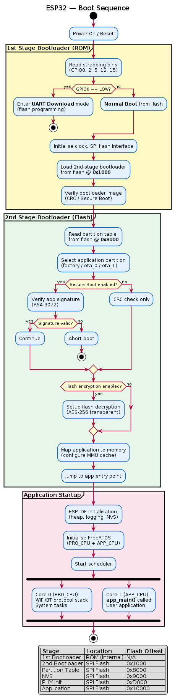

# ESP32 — Firmware & Boot Process

## Boot Sequence



> PlantUML source: [ESP32_boot_sequence.puml](diagrams/ESP32_boot_sequence.puml)

## Flash Partition Layout

Default ESP-IDF partition layout:

| Offset | Size | Name | Type | Description |
|--------|------|------|------|-------------|
| 0x1000 | 28 KB | bootloader | bootloader | Second-stage bootloader |
| 0x8000 | 4 KB | partition-table | data | Partition table |
| 0x9000 | 20 KB | nvs | data (NVS) | Non-volatile storage (WiFi creds, etc.) |
| 0xD000 | 8 KB | phy_init | data | PHY calibration data |
| 0x10000 | ~1.5 MB | factory | app | Main application |
| — | ~1.5 MB | ota_0 | app | OTA slot 0 (if OTA enabled) |
| — | ~1.5 MB | ota_1 | app | OTA slot 1 (if OTA enabled) |

## ESP-IDF Build System

### Key Components
- **CMake-based** build system
- **Kconfig** for project configuration (`menuconfig`)
- **Component architecture**: modular, each component has its own CMakeLists.txt

### Build & Flash Commands
```bash
# Configure project
idf.py menuconfig

# Build
idf.py build

# Flash
idf.py -p /dev/ttyUSB0 flash

# Monitor serial output
idf.py -p /dev/ttyUSB0 monitor

# All-in-one
idf.py -p /dev/ttyUSB0 flash monitor
```

## FreeRTOS on ESP32

ESP-IDF uses a modified **FreeRTOS** for symmetric multiprocessing (SMP):

- Tasks can be pinned to Core 0 (PRO_CPU) or Core 1 (APP_CPU), or float
- WiFi/BT protocol stacks run on Core 0 by default
- `app_main()` runs on Core 1 by default
- Standard FreeRTOS primitives: tasks, queues, semaphores, mutexes, event groups
- Tick rate: 100 Hz (configurable)

## NVS (Non-Volatile Storage)

- Key-value store in flash
- Wear-leveled
- Stores WiFi credentials, calibration data, user config
- Supports encryption (NVS encryption feature)

> TODO: Add custom partition table example and bootloader customisation guide
