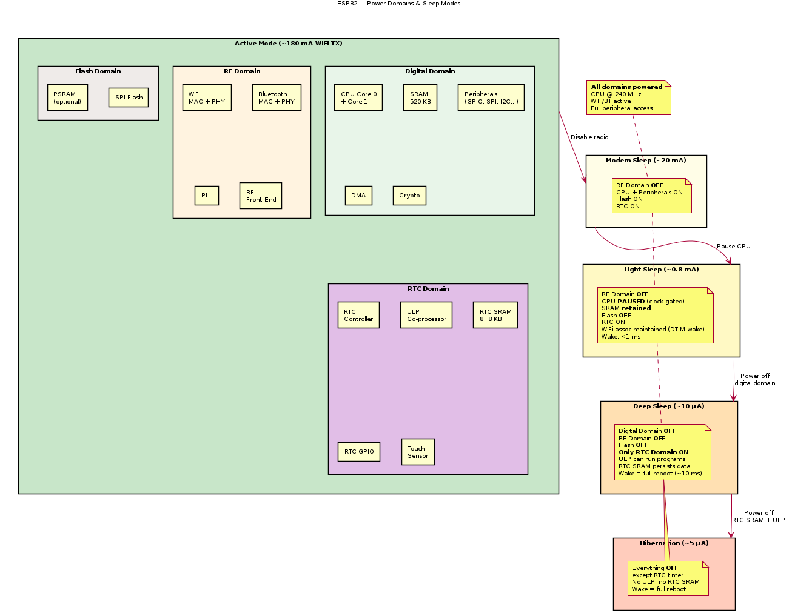

# ESP32 — Power Management

## Supply Requirements

| Parameter | Min | Typ | Max | Unit |
|-----------|-----|-----|-----|------|
| VDD3P3 (main supply) | 2.3 | 3.3 | 3.6 | V |
| VDD_SDIO (flash/PSRAM) | 1.8 / 3.3 | — | — | V |

## Power Consumption by Mode

| Mode | Description | Current (typ) |
|------|------------|----------------|
| Active (WiFi TX) | WiFi transmitting, 802.11n HT40 | 180–240 mA |
| Active (WiFi RX) | WiFi receiving | 95–100 mA |
| Active (BT TX) | Bluetooth transmitting | 130 mA |
| Active (CPU only) | Dual-core @ 240 MHz, no radio | 30–68 mA |
| Modem Sleep | CPU active, WiFi/BT radio off | 20–30 mA |
| Light Sleep | CPU paused, WiFi maintains connection (DTIM) | 0.8 mA |
| Deep Sleep | RTC + ULP only, main SRAM off | 10 µA |
| Hibernation | RTC timer only | 5 µA |
| Power Off | No supply | 0 µA |

## Power Domains

```
┌─────────────────────────────────────────────────────┐
│                 ESP32 Power Domains                  │
│                                                      │
│  ┌──────────────────┐  ┌────────────────────────┐   │
│  │ Digital Domain    │  │ RTC Domain              │   │
│  │                  │  │                          │   │
│  │ - CPU cores      │  │ - RTC controller         │   │
│  │ - SRAM           │  │ - ULP co-processor       │   │
│  │ - Peripherals    │  │ - RTC SRAM (8 KB)        │   │
│  │ - DMA            │  │ - RTC GPIO               │   │
│  │ - WiFi/BT MAC    │  │ - Touch sensor           │   │
│  │                  │  │ - ADC (in ULP mode)       │   │
│  │ OFF in deep sleep│  │ ACTIVE in deep sleep     │   │
│  └──────────────────┘  └────────────────────────┘   │
│                                                      │
│  ┌──────────────────┐  ┌────────────────────────┐   │
│  │ RF Domain        │  │ Flash Domain            │   │
│  │                  │  │                          │   │
│  │ - WiFi PHY/RF    │  │ - SPI Flash              │   │
│  │ - BT PHY/RF      │  │ - PSRAM (optional)       │   │
│  │ - PLL            │  │                          │   │
│  │                  │  │ OFF in deep sleep        │   │
│  │ OFF in modem slp │  │                          │   │
│  └──────────────────┘  └────────────────────────┘   │
└─────────────────────────────────────────────────────┘
```

## Sleep Modes Detail

### Modem Sleep
- WiFi/BT radio powered down
- CPU and peripherals remain active
- Wake-up: Instant (radio re-init needed)
- Use case: CPU-bound tasks without connectivity

### Light Sleep
- CPU clock gated (paused)
- SRAM contents preserved
- WiFi association maintained (wakes for DTIM beacons)
- Wake sources: timer, GPIO, touch, UART, external interrupt
- Wake-up latency: ~1 ms

### Deep Sleep
- Main CPU and SRAM powered off
- Only RTC domain active
- RTC SRAM (8 KB) preserves data
- ULP co-processor can run programs
- Wake sources: RTC timer, ext0/ext1 GPIO, touch, ULP
- Wake-up: Full reboot (runs bootloader)
- Wake-up latency: ~10 ms

### Hibernation
- Everything off except RTC timer
- No ULP, no RTC SRAM (data lost)
- Wake source: RTC timer only
- Lowest power: ~5 µA

## Low-Power Tips

1. Use deep sleep between measurements for battery-powered sensors
2. Use ULP co-processor for periodic ADC reads during deep sleep
3. Disable WiFi/BT when not needed (modem sleep)
4. Reduce CPU clock from 240 MHz to 80 MHz when possible
5. Use light sleep for latency-sensitive WiFi applications
6. Store persistent data in RTC SRAM (survives deep sleep)

## Power Domain Diagram



> PlantUML source: [ESP32_power_domains.puml](diagrams/ESP32_power_domains.puml)

> TODO: Add measured power consumption graphs and battery life estimates
