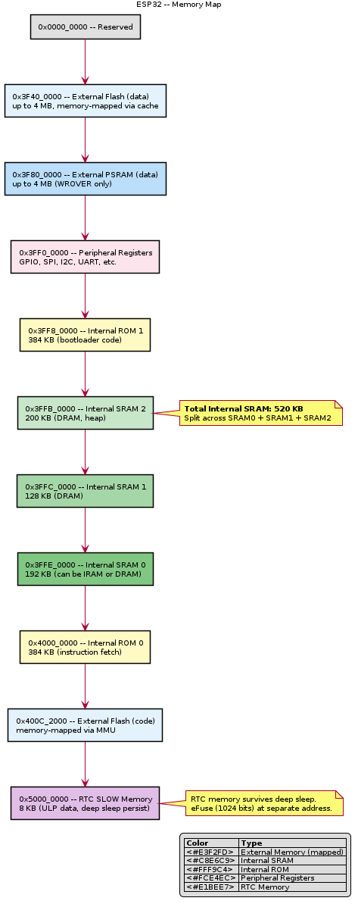

# ESP32 — Registers & Memory Map

## Memory Map Overview

```
0x0000_0000 ┌──────────────────────────┐
            │ Internal ROM (448 KB)     │ Bootloader, crypto libs
0x4007_0000 ├──────────────────────────┤
            │ Internal SRAM0 (192 KB)   │ Instruction cache / IRAM
0x3FFB_0000 ├──────────────────────────┤
            │ Internal SRAM1 (128 KB)   │ Data RAM (DRAM)
0x3FFA_E000 ├──────────────────────────┤
            │ Internal SRAM2 (200 KB)   │ Data RAM (DRAM)
0x3FF8_0000 ├──────────────────────────┤
            │ RTC FAST Memory (8 KB)    │ ULP, RTC code
0x5000_0000 ├──────────────────────────┤
            │ RTC SLOW Memory (8 KB)    │ ULP data, deep-sleep persist
0x3FF0_0000 ├──────────────────────────┤
            │ Peripheral registers      │ GPIO, SPI, I2C, UART, etc.
0x3FF4_0000 ├──────────────────────────┤
            │ External Flash (via SPI)  │ Up to 16 MB, memory-mapped
0x400C_2000 ├──────────────────────────┤
            │ External PSRAM (optional) │ Up to 8 MB, memory-mapped
            └──────────────────────────┘
```

## Key Peripheral Register Blocks

| Peripheral | Base Address | Size | Description |
|------------|-------------|------|-------------|
| GPIO | 0x3FF4_4000 | 0x6C | GPIO control, input/output, interrupts |
| SPI2 (HSPI) | 0x3FF6_4000 | 0x80 | SPI2 controller |
| SPI3 (VSPI) | 0x3FF6_5000 | 0x80 | SPI3 controller |
| I2C0 | 0x3FF5_3000 | 0x98 | I2C controller 0 |
| I2C1 | 0x3FF6_7000 | 0x98 | I2C controller 1 |
| UART0 | 0x3FF4_0000 | 0x7C | UART controller 0 |
| UART1 | 0x3FF5_0000 | 0x7C | UART controller 1 |
| UART2 | 0x3FF6_E000 | 0x7C | UART controller 2 |
| Timer Group 0 | 0x3FF5_F000 | 0x98 | 2× 64-bit timers + watchdog |
| Timer Group 1 | 0x3FF6_0000 | 0x98 | 2× 64-bit timers + watchdog |
| LED PWM | 0x3FF5_9000 | 0xC4 | 16-channel LED PWM |
| ADC | 0x3FF4_8800 | — | SAR ADC control |
| DAC | 0x3FF4_8800 | — | DAC control (shared with ADC block) |
| RTC | 0x3FF4_8000 | — | RTC control, deep sleep, ULP |

## GPIO Register Example

### GPIO_OUT_REG (0x3FF44004)

| Bits | Name | Access | Description |
|------|------|--------|-------------|
| 31:0 | GPIO_OUT_DATA | R/W | Output value for GPIO 0–31 |

### GPIO_OUT_W1TS_REG (0x3FF44008)

| Bits | Name | Access | Description |
|------|------|--------|-------------|
| 31:0 | GPIO_OUT_DATA_W1TS | WO | Write 1 to set corresponding GPIO output bit |

### GPIO_OUT_W1TC_REG (0x3FF4400C)

| Bits | Name | Access | Description |
|------|------|--------|-------------|
| 31:0 | GPIO_OUT_DATA_W1TC | WO | Write 1 to clear corresponding GPIO output bit |

### GPIO_ENABLE_REG (0x3FF44020)

| Bits | Name | Access | Description |
|------|------|--------|-------------|
| 31:0 | GPIO_ENABLE_DATA | R/W | 1 = output enable for GPIO 0–31 |

### GPIO_IN_REG (0x3FF4403C)

| Bits | Name | Access | Description |
|------|------|--------|-------------|
| 31:0 | GPIO_IN_DATA | RO | Input value of GPIO 0–31 |

## eFuse Block

1024 bits of one-time-programmable memory containing:

| Block | Content |
|-------|---------|
| EFUSE_BLK0 | System parameters (MAC, chip revision, flash encryption config) |
| EFUSE_BLK1 | Flash encryption key |
| EFUSE_BLK2 | Secure boot key |
| EFUSE_BLK3 | User-programmable (custom data) |

## Memory Map Diagram



> PlantUML source: [ESP32_memory_map.puml](diagrams/ESP32_memory_map.puml)

> TODO: Add complete register maps for SPI, I2C, UART, Timer peripherals
