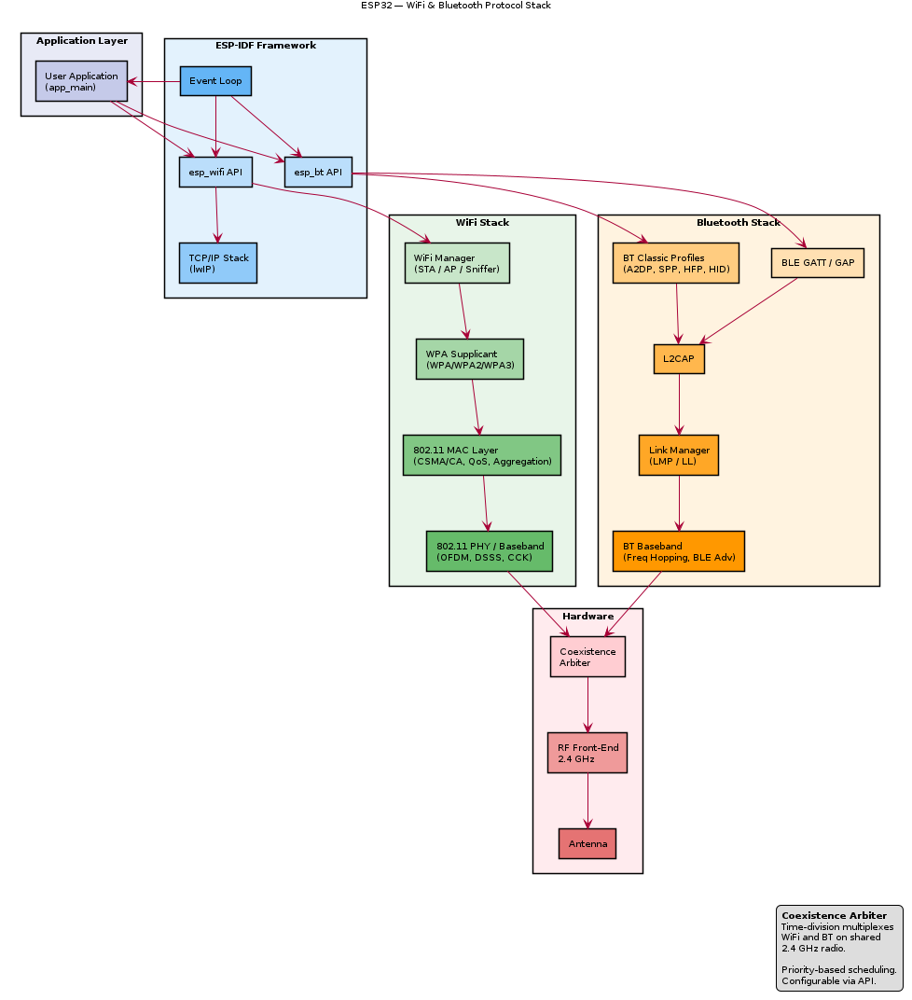

# ESP32 — WiFi & Bluetooth Internals

## WiFi Subsystem

### Standards Supported
- IEEE 802.11 b/g/n (2.4 GHz only)
- Channel bandwidth: 20 MHz (HT20), 40 MHz (HT40)
- Max data rate: 150 Mbps (HT40, MCS7)

### WiFi Architecture

```
┌────────────────────────────────────────────────┐
│              WiFi Subsystem                     │
│                                                 │
│  ┌─────────┐  ┌──────────┐  ┌──────────────┐  │
│  │ WiFi    │  │ Baseband │  │ RF Front-End │  │
│  │ MAC     │  │ (PHY)    │  │ (shared)     │  │
│  │         │  │          │  │              │  │
│  │ - CSMA/ │  │ - OFDM   │  │ - PA (power  │  │
│  │   CA    │  │ - DSSS   │  │   amplifier) │  │
│  │ - QoS   │  │ - CCK    │  │ - LNA (low   │  │
│  │ - Agg.  │  │ - MCS    │  │   noise amp) │  │
│  │ - Frag. │  │ - FEC    │  │ - Balun      │  │
│  │ - WPA3  │  │          │  │ - RF switch  │  │
│  └─────────┘  └──────────┘  └──────────────┘  │
└────────────────────────────────────────────────┘
```

### WiFi Modes
- **Station (STA)**: Connects to an access point
- **SoftAP**: Acts as an access point (up to 10 clients)
- **STA+SoftAP**: Simultaneous station and AP
- **Sniffer/Promiscuous**: Raw 802.11 frame capture

### WiFi Security
- WPA/WPA2/WPA3 (Personal and Enterprise)
- Hardware AES acceleration for CCMP encryption
- Protected Management Frames (PMF)

### WiFi Power Features
- Power save modes: DTIM-based sleep
- Listen interval configurable
- Modem sleep: WiFi radio off between beacons

---

## Bluetooth Subsystem

### Standards Supported
- Bluetooth Classic (BR/EDR) v4.2
- Bluetooth Low Energy (BLE) v4.2
- Dual-mode: Classic + BLE simultaneously

### Bluetooth Architecture

```
┌────────────────────────────────────────────────┐
│           Bluetooth Subsystem                   │
│                                                 │
│  ┌──────────────────┐  ┌────────────────────┐  │
│  │ BT Classic       │  │ BLE                │  │
│  │                  │  │                    │  │
│  │ - L2CAP          │  │ - GAP / GATT       │  │
│  │ - SDP            │  │ - ATT              │  │
│  │ - RFCOMM         │  │ - SM               │  │
│  │ - A2DP (audio)   │  │ - L2CAP            │  │
│  │ - AVRCP          │  │                    │  │
│  │ - SPP (serial)   │  │ Advertisement      │  │
│  │ - HFP            │  │ Scanning           │  │
│  └──────────────────┘  └────────────────────┘  │
│                                                 │
│  ┌──────────────────────────────────────────┐  │
│  │ Baseband / Link Controller               │  │
│  │ - Frequency hopping (79 channels)        │  │
│  │ - Piconet management                     │  │
│  │ - BLE advertising channels (37, 38, 39)  │  │
│  └──────────────────────────────────────────┘  │
└────────────────────────────────────────────────┘
```

### Bluetooth Profiles (Classic)
| Profile | Description |
|---------|-------------|
| A2DP | Advanced Audio Distribution — stereo audio streaming |
| AVRCP | AV Remote Control — play/pause/skip |
| SPP | Serial Port Profile — virtual UART over BT |
| HFP | Hands-Free Profile — phone calls |
| HID | Human Interface Device — keyboards, mice |

### BLE Features
- GATT server and client
- Up to 9 simultaneous connections
- Advertising (connectable, non-connectable, scannable)
- Central and Peripheral roles
- Scan with filtering

---

## WiFi + Bluetooth Coexistence

The ESP32 shares a single 2.4 GHz radio between WiFi and Bluetooth. A hardware coexistence arbiter manages access:

- Time-division multiplexing between WiFi and BT
- Priority-based arbitration (configurable)
- Performance trade-off: simultaneous WiFi + BT reduces throughput of both
- ESP-IDF provides coexistence configuration API

## WiFi & Bluetooth Stack Diagram



> PlantUML source: [ESP32_wifi_bt_stack.puml](diagrams/ESP32_wifi_bt_stack.puml)

> TODO: Add coexistence timing diagrams and throughput benchmarks
