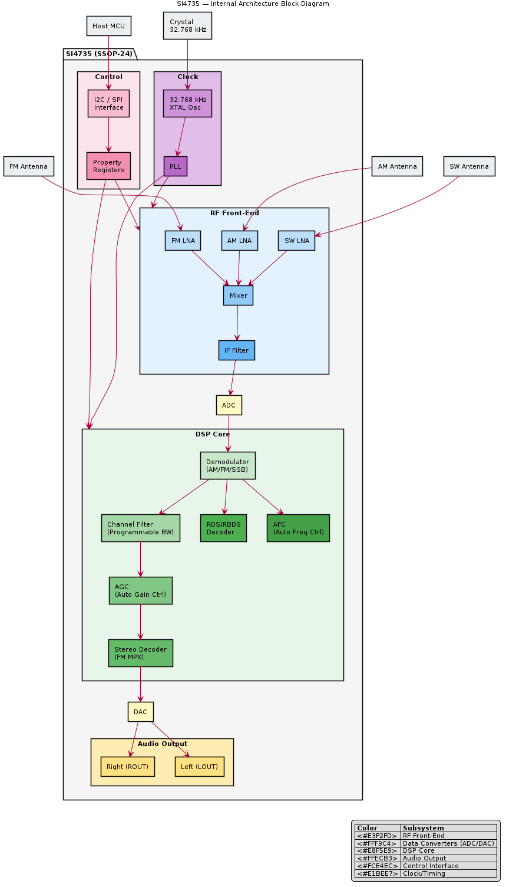

# SI4735 — Overview

## General Description

The **SI4735** is a broadcast AM/FM/SW/LW radio receiver IC manufactured by **Silicon Labs**. It integrates a complete radio receiver with a digital signal processing (DSP) core, requiring minimal external components.

## Key Specifications

| Parameter | Value |
|-----------|-------|
| Manufacturer | Silicon Labs |
| Type | AM/FM/SW/LW Tuner IC |
| Core | Internal DSP |
| FM Range | 64–108 MHz |
| AM Range | 520–1710 kHz |
| SW Range | 2.3–26.1 MHz |
| LW Range | 153–279 kHz |
| Supply Voltage | 2.7–5.5 V |
| Interface | I2C or SPI |
| Package | SSOP-24 |
| RDS/RBDS | Yes (FM) |
| Audio Output | Analog (line-level) |

## Key Features

- Fully integrated AM/FM/SW/LW receiver
- On-chip DSP for demodulation, filtering, AGC
- Programmable via I2C or SPI
- RDS/RBDS decoding (FM)
- Automatic frequency control (AFC)
- Programmable de-emphasis (50/75 µs)
- Seek and tune functions
- Signal quality indicators (RSSI, SNR, multipath)
- Minimal external components (antenna, decoupling caps, crystal)

## Variants in the SI473x Family

| Part | AM | FM | SW | LW | SSB | Notes |
|------|----|----|----|----|-----|-------|
| SI4730 | ✓ | ✓ | ✗ | ✗ | ✗ | AM/FM only |
| SI4731 | ✓ | ✓ | ✗ | ✗ | ✗ | + RDS |
| SI4732 | ✓ | ✓ | ✓ | ✗ | ✗ | + Shortwave |
| SI4734 | ✓ | ✓ | ✓ | ✗ | ✗ | + RDS + WB |
| **SI4735** | **✓** | **✓** | **✓** | **✓** | **✗** | **Full band coverage + RDS** |
| SI4735-D60 | ✓ | ✓ | ✓ | ✓ | ✓* | SSB via firmware patch |

*SSB support on SI4735-D60 requires loading an SSB firmware patch via I2C at boot.

## Block Diagram

> See [architecture.md](architecture.md) for detailed breakdown

## Datasheet

- [SI4735 Programming Guide (AN332)](https://www.silabs.com/documents/public/application-notes/AN332.pdf)
- [SI4735 Datasheet](https://www.silabs.com/documents/public/data-sheets/Si4730-31-34-35-D60.pdf)
