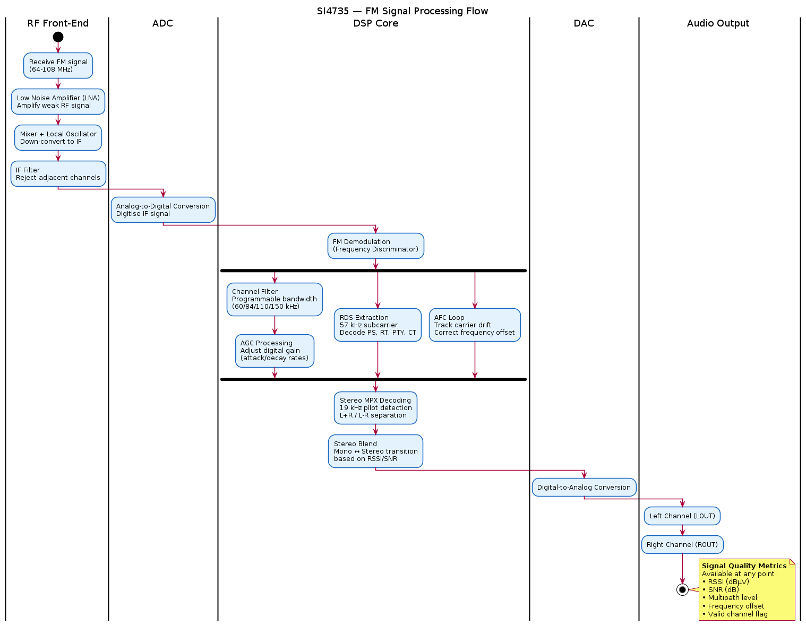

# SI4735 — Architecture

## High-Level Block Diagram

> PlantUML source: [SI4735_architecture.puml](diagrams/SI4735_architecture.puml)

## Internal Components

### 1. RF Front-End
- **LNA (Low Noise Amplifier)**: Separate LNAs for AM, FM, and SW bands
- **Mixer**: Down-converts RF to intermediate frequency (IF)
- **IF Filter**: Band selection, image rejection

### 2. ADC (Analog-to-Digital Converter)
- Digitises the IF signal for DSP processing
- Enables all subsequent processing in the digital domain

### 3. DSP Core
The heart of the SI4735. Handles:
- **Demodulation**: AM envelope detection, FM discriminator
- **Channel filtering**: Programmable bandwidth selection
- **AGC (Automatic Gain Control)**: Maintains consistent signal level
- **Stereo decoding**: FM stereo multiplex (MPX) decoding
- **RDS/RBDS decoding**: Station name, programme type, clock
- **AFC (Automatic Frequency Control)**: Fine-tunes to exact carrier

### 4. DAC (Digital-to-Analog Converter)
- Converts processed digital audio back to analog
- Drives left/right audio output pins

### 5. Control Interface
- I2C (default) or SPI (selected at power-up via SEN pin)
- Command/response protocol — host MCU sends commands, reads responses
- Properties system — hundreds of configurable parameters

### 6. Reference Oscillator
- External 32.768 kHz crystal provides timing reference
- Internal PLL generates all required clocks from this reference

## Signal Flow

> PlantUML source: [SI4735_signal_flow.puml](diagrams/SI4735_signal_flow.puml)

## Key Architectural Insight

Unlike analog tuners (e.g., TDA7088), the SI4735 digitises the signal early and performs nearly all processing in the DSP domain. This enables:
- Software-configurable bandwidth
- Digital AGC with precise control
- RDS decoding without external decoders
- Consistent performance across temperature/voltage variations
