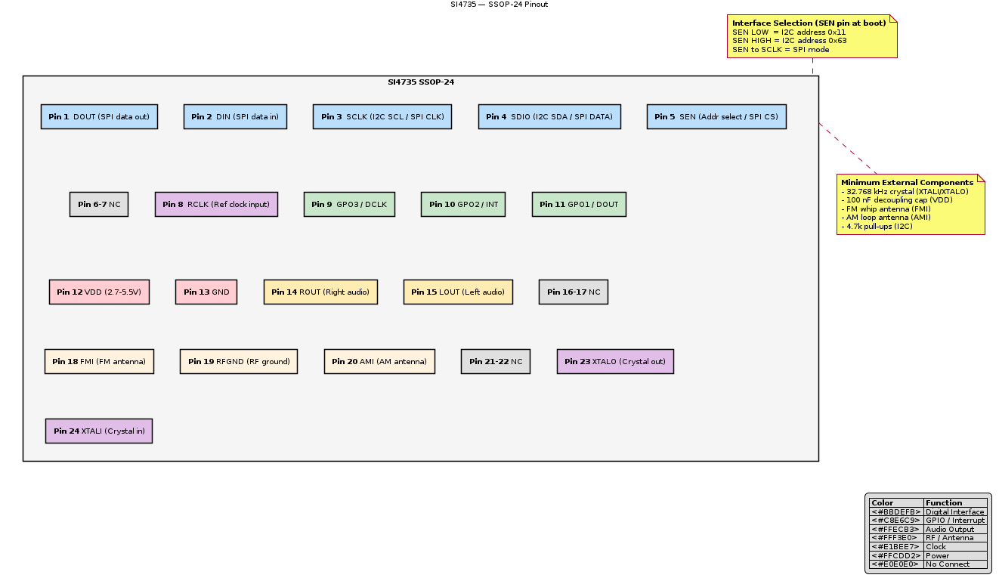

# SI4735 — Pinout

## Package

SSOP-24 (24-pin Shrink Small Outline Package)

## Pin Assignments

| Pin # | Name | Direction | Description |
|-------|------|-----------|-------------|
| 1 | DOUT | Output | SPI data out / I2C not used (tie to GND in I2C mode) |
| 2 | DIN | Input | SPI data in |
| 3 | SCLK | Input | I2C clock (SCL) / SPI clock |
| 4 | SDIO | I/O | I2C data (SDA) / SPI data |
| 5 | SEN | Input | I2C address select / SPI chip select |
| 6 | NC | — | No connection |
| 7 | NC | — | No connection |
| 8 | RCLK | Input | Reference clock input (32.768 kHz crystal) |
| 9 | GPO3/DCLK | Output | General purpose output 3 / digital audio clock |
| 10 | GPO2/INT | Output | General purpose output 2 / interrupt |
| 11 | GPO1/DOUT | Output | General purpose output 1 / digital audio data |
| 12 | VDD | Power | Supply voltage (2.7–5.5 V) |
| 13 | GND | Power | Ground |
| 14 | ROUT | Output | Right audio output |
| 15 | LOUT | Output | Left audio output |
| 16 | NC | — | No connection |
| 17 | NC | — | No connection |
| 18 | FMI | Input | FM antenna input |
| 19 | RFGND | Power | RF ground |
| 20 | AMI | Input | AM antenna input |
| 21 | NC | — | No connection |
| 22 | NC | — | No connection |
| 23 | XTALO | Output | Crystal oscillator output |
| 24 | XTALI | Input | Crystal oscillator input |

## Interface Selection (SEN Pin)

| SEN State at Reset | Mode | I2C Address |
|---------------------|------|-------------|
| LOW | I2C | 0x11 (0b0010001) |
| HIGH | I2C | 0x63 (0b1100011) |
| Directly to SCLK | SPI | N/A |

## Typical Connection Diagram

```
                        SI4735 (SSOP-24)
                    ┌───────────────────┐
  MCU SDA ─────────┤ SDIO          VDD ├──── 3.3V
  MCU SCL ─────────┤ SCLK         GND ├──── GND
  MCU GPIO ────────┤ SEN         ROUT ├──── Right Audio
  MCU INT  ◄───────┤ GPO2/INT   LOUT ├──── Left Audio
                    ┤ RCLK       FMI  ├──── FM Whip Antenna
  32.768kHz XTAL ──┤ XTALI      AMI  ├──── AM Loop Antenna
                ┌──┤ XTALO     RFGND ├──── RF Ground
                │   └───────────────────┘
               GND (via cap)
```

## Notes

- Decoupling capacitor (100 nF) required on VDD
- FM antenna: simple wire (75 cm for ideal quarter-wave at 100 MHz)
- AM antenna: external ferrite loop or wire antenna
- Pull-up resistors on I2C lines (4.7 kΩ typical)

## Pinout Diagram



> PlantUML source: [SI4735_pinout.puml](diagrams/SI4735_pinout.puml)
