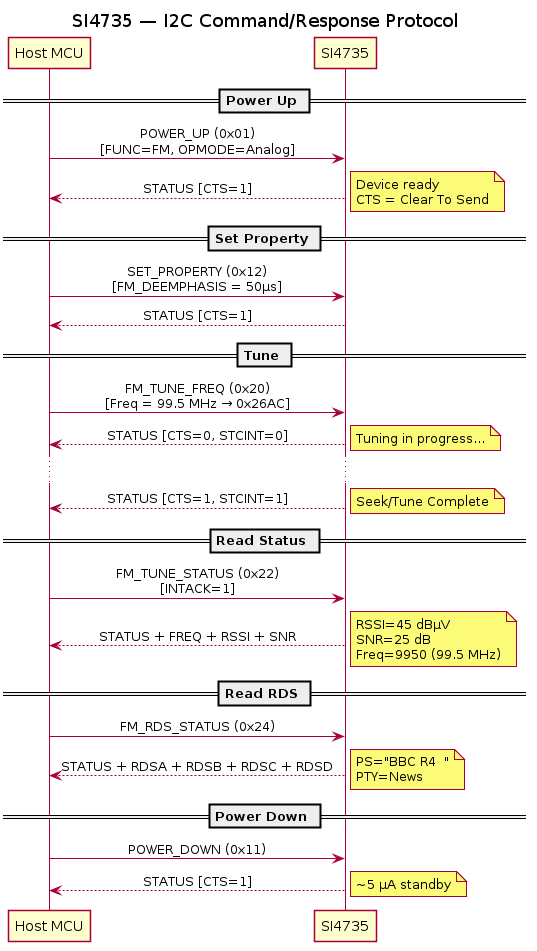

# SI4735 — Registers & Commands

## Command/Response Protocol



> PlantUML source: [SI4735_command_flow.puml](diagrams/SI4735_command_flow.puml)

The SI4735 uses a **command-based** protocol rather than traditional register-mapped I/O. The host MCU sends commands via I2C/SPI and reads back status/response bytes.

### Command Format

```
[CMD] [ARG1] [ARG2] ... [ARGn]
```

### Response Format

```
[STATUS] [RESP1] [RESP2] ... [RESPn]
```

### Status Byte (Common to All Responses)

| Bit | Name | Description |
|-----|------|-------------|
| 7 | CTS | Clear to Send — ready for next command |
| 6 | ERR | Error — command failed |
| 5 | — | Reserved |
| 4 | RSQINT | RSQ interrupt |
| 3 | RDSINT | RDS interrupt (FM only) |
| 2 | — | Reserved |
| 1 | — | Reserved |
| 0 | STCINT | Seek/Tune Complete interrupt |

## Key Commands

### Power & Mode

| Command | Opcode | Args | Description |
|---------|--------|------|-------------|
| POWER_UP | 0x01 | 2 | Power up device, select function (FM/AM) |
| POWER_DOWN | 0x11 | 0 | Power down device |
| SET_PROPERTY | 0x12 | 5 | Set a property value |
| GET_PROPERTY | 0x13 | 3 | Read a property value |
| GET_INT_STATUS | 0x14 | 0 | Read interrupt status |

### FM Commands

| Command | Opcode | Args | Description |
|---------|--------|------|-------------|
| FM_TUNE_FREQ | 0x20 | 4 | Tune to FM frequency |
| FM_SEEK_START | 0x21 | 1 | Begin FM seek |
| FM_TUNE_STATUS | 0x22 | 1 | Get tune status (freq, RSSI, SNR) |
| FM_RSQ_STATUS | 0x23 | 1 | Get signal quality (RSSI, SNR, multipath) |
| FM_RDS_STATUS | 0x24 | 1 | Get RDS data |
| FM_AGC_STATUS | 0x27 | 0 | Get AGC status |
| FM_AGC_OVERRIDE | 0x28 | 2 | Override AGC settings |

### AM Commands

| Command | Opcode | Args | Description |
|---------|--------|------|-------------|
| AM_TUNE_FREQ | 0x40 | 5 | Tune to AM frequency |
| AM_SEEK_START | 0x41 | 1 | Begin AM seek |
| AM_TUNE_STATUS | 0x42 | 1 | Get AM tune status |
| AM_RSQ_STATUS | 0x43 | 1 | Get AM signal quality |
| AM_AGC_STATUS | 0x47 | 0 | Get AM AGC status |
| AM_AGC_OVERRIDE | 0x48 | 2 | Override AM AGC settings |

## Key Properties

| Property | Address | Range | Default | Description |
|----------|---------|-------|---------|-------------|
| FM_DEEMPHASIS | 0x1100 | 1–2 | 1 (75µs) | De-emphasis: 1=75µs (US), 2=50µs (Europe) |
| FM_BLEND_STEREO_THRESHOLD | 0x1105 | 0–127 | 49 | RSSI threshold for stereo |
| FM_BLEND_MONO_THRESHOLD | 0x1106 | 0–127 | 30 | RSSI threshold for mono |
| AM_CHANNEL_FILTER | 0x3102 | 0–3 | 0 | AM bandwidth selection |
| RX_VOLUME | 0x4000 | 0–63 | 63 | Audio volume |
| RX_HARD_MUTE | 0x4001 | 0–3 | 0 | Mute left/right channels |

> TODO: Add complete property table from AN332

## POWER_UP Command Detail

```
Command:  0x01  [ARG1]  [ARG2]
          │      │       └── OPMODE: 0x05 = analog audio out
          │      └── FUNC: bit 4 = patch enable
          │               bits 3:0 = 0x00 (FM), 0x01 (AM)
          └── Command opcode
```

## Example: Tune to 99.5 MHz FM

```
Send:  0x20  0x00  0x26  0xAC  0x00
       │      │     └────┘     └── Antenna capacitor (auto)
       │      │     9900 × 10 kHz = 0x26AC
       │      └── FREEZE: 0 (don't freeze metrics)
       └── FM_TUNE_FREQ opcode
```
