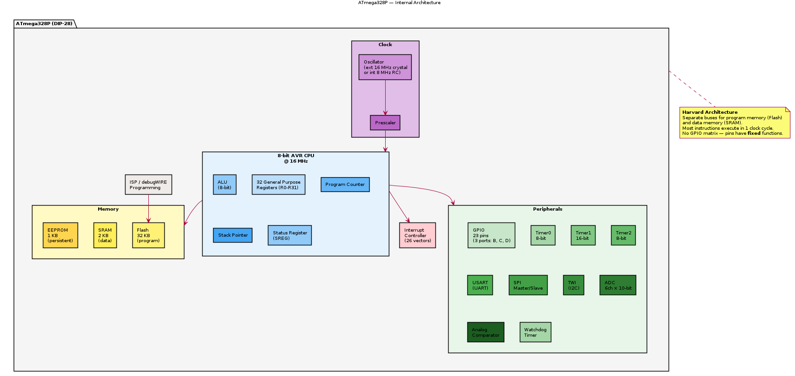

# ATmega328P — Overview

## General Description

The **ATmega328P** is an 8-bit AVR microcontroller by **Microchip (formerly Atmel)**. It is the chip at the heart of the Arduino Uno and Arduino Nano boards — the most widely used entry-level MCU in education and hobbyist projects.

## Key Specifications

| Parameter | Value |
|-----------|-------|
| Manufacturer | Microchip / Atmel |
| Core | 8-bit AVR (Harvard architecture) |
| Clock Speed | Up to 20 MHz (16 MHz on Arduino) |
| Flash | 32 KB (0.5 KB used by bootloader) |
| SRAM | 2 KB |
| EEPROM | 1 KB |
| GPIO | 23 |
| ADC | 6× 10-bit (8 on SMD package) |
| Timers | 2× 8-bit, 1× 16-bit |
| UART | 1× |
| SPI | 1× |
| I2C (TWI) | 1× |
| Supply Voltage | 1.8–5.5 V |
| Package | DIP-28, TQFP-32, QFN-32 |

## Architectural Contrast

| Feature | ATmega328P | ESP32 |
|---------|-----------|-------|
| Architecture | 8-bit Harvard | 32-bit Modified Harvard |
| Cores | 1 | 2 |
| Clock | 16 MHz | 240 MHz |
| RAM | 2 KB | 520 KB |
| Flash | 32 KB | 4 MB (external) |
| WiFi/BT | No | Yes |
| GPIO Matrix | Fixed pins | Flexible routing |
| Complexity | Minimal | Complex SoC |

The ATmega328P is ideal for studying because its architecture is simple enough to understand at the register level completely.

## Architecture Diagram

> PlantUML source: [ATmega328P_architecture.puml](diagrams/ATmega328P_architecture.puml)

> TODO: Add complete register map and AVR instruction set overview
