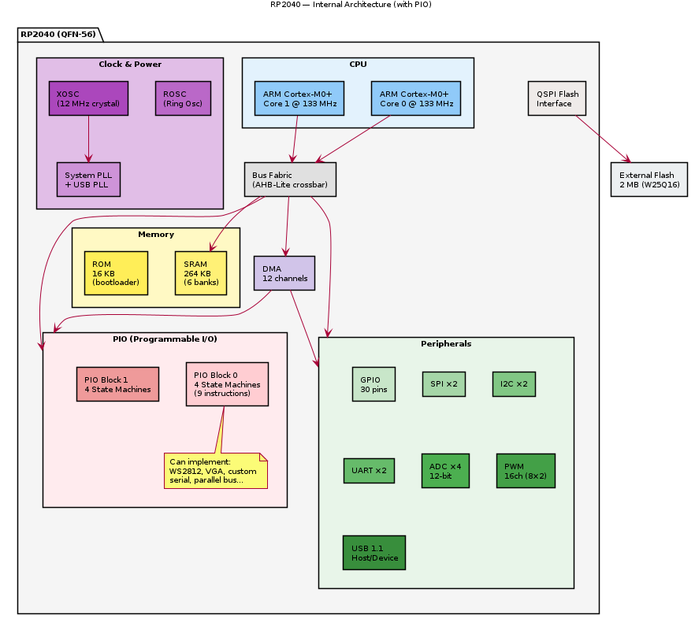

# RP2040 — Overview

## General Description

The **RP2040** is a dual-core ARM Cortex-M0+ microcontroller designed by **Raspberry Pi Ltd**. Used in the Raspberry Pi Pico board. Notable for its unique PIO (Programmable I/O) state machines.

## Key Specifications

| Parameter | Value |
|-----------|-------|
| Manufacturer | Raspberry Pi Ltd |
| Core | Dual ARM Cortex-M0+ @ 133 MHz |
| SRAM | 264 KB (6 banks) |
| Flash | External (typically 2 MB via QSPI) |
| ROM | 16 KB (bootloader) |
| GPIO | 30 |
| ADC | 4× 12-bit (500 ksps) |
| PIO | 2× PIO blocks, 4 state machines each |
| SPI | 2× |
| I2C | 2× |
| UART | 2× |
| PWM | 16 channels (8 slices × 2) |
| USB | USB 1.1 Host/Device |
| Supply Voltage | 1.8–3.6 V |
| Package | QFN-56 (7×7 mm) |

## Unique Feature: PIO State Machines

The PIO blocks can implement custom I/O protocols in hardware:
- Each PIO block has 4 independent state machines
- 9 instructions (JMP, WAIT, IN, OUT, PUSH, PULL, MOV, IRQ, SET)
- Can implement: WS2812, VGA output, custom serial protocols, etc.
- Runs independently from CPU — deterministic timing

## Architectural Contrast with ESP32

| Feature | RP2040 | ESP32 |
|---------|--------|-------|
| Core | ARM Cortex-M0+ | Xtensa LX6 |
| Architecture | ARMv6-M | Xtensa (proprietary) |
| WiFi/BT | No (requires add-on) | Built-in |
| PIO | Yes (unique) | No |
| Security | No hardware crypto | AES/SHA/RSA hardware |

## Architecture Diagram

> PlantUML source: [RP2040_architecture.puml](diagrams/RP2040_architecture.puml)

> TODO: Add PIO programming guide and memory map

---

**← Prev** [ATmega328P](../ATmega328P/) · [↑ Back to Main README](../../../README.md) · **Next →** [STM32F103](../STM32F103/)
