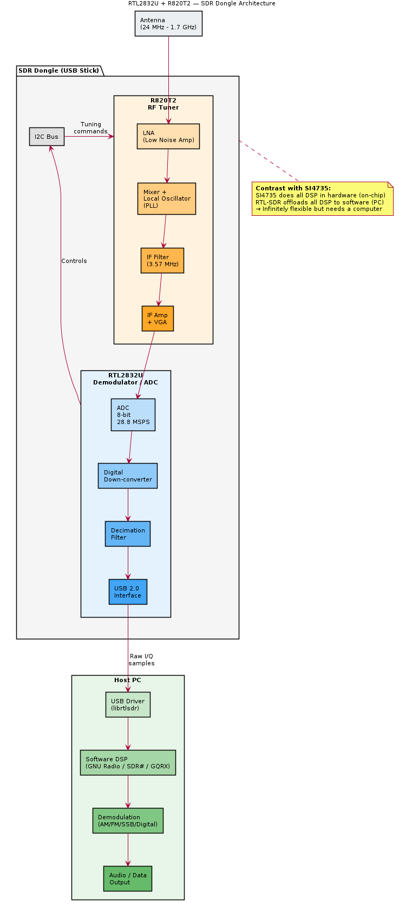

# RTL2832U — Overview

## General Description

The **RTL2832U** is a DVB-T demodulator IC by **Realtek**, famously repurposed as a wideband **Software Defined Radio (SDR)** receiver. When paired with a tuner IC (typically R820T2), it can receive signals from ~24 MHz to ~1.7 GHz.

## Key Specifications

| Parameter | Value |
|-----------|-------|
| Manufacturer | Realtek |
| Type | DVB-T Demodulator / SDR ADC |
| Interface | USB 2.0 |
| ADC | 8-bit, up to 3.2 MSPS |
| Bandwidth | Up to 3.2 MHz (I/Q) |
| Paired With | R820T2 (or similar RF tuner) |
| Package | QFN-48 |

## SDR Architecture

```
Antenna → R820T2 (RF Tuner) → RTL2832U (ADC + USB) → Host PC (software demod)
```

The RTL2832U digitises the IF signal from the tuner and streams raw I/Q samples to the host via USB. All demodulation happens in software (e.g., GNU Radio, SDR#, GQRX).

## Relevance

- The chip that launched the affordable SDR revolution
- Directly relevant to SDR_Notes repository work
- Demonstrates the contrast: hardware DSP (SI4735) vs software DSP (RTL2832U + PC)

## SDR Dongle Architecture Diagram



> PlantUML source: [SDR_dongle_architecture.puml](diagrams/SDR_dongle_architecture.puml)

> TODO: Add register documentation, USB protocol details, and I/Q data format
