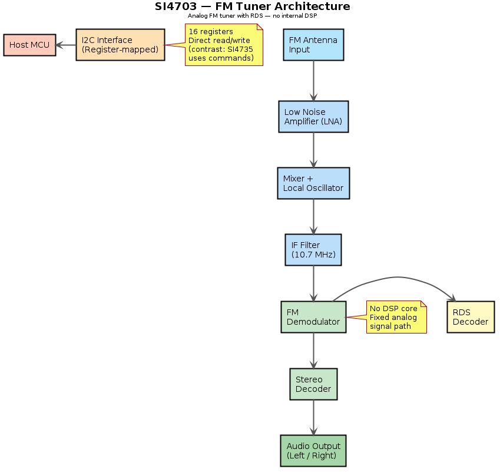

# SI4703 — Overview

## General Description

The **SI4703** is an FM-only radio tuner IC by **Silicon Labs**. Unlike the SI4735, it has **no internal DSP** — it uses analog signal processing with digital control. Good baseline for understanding how a non-DSP tuner compares.

## Key Specifications

| Parameter | Value |
|-----------|-------|
| Manufacturer | Silicon Labs |
| Type | FM Tuner (no AM/SW) |
| FM Range | 76–108 MHz |
| Supply Voltage | 2.7–5.5 V |
| Interface | I2C (2-wire) |
| RDS/RBDS | Yes |
| Audio Output | Analog (headphone-level) |
| Package | QFN-20 (3×3 mm) |

## Key Difference from SI4735

| Feature | SI4703 | SI4735 |
|---------|--------|--------|
| DSP | No | Yes |
| AM/SW | No | Yes |
| Bandwidth selection | Fixed | Programmable |
| Control | Register-mapped I2C | Command/response protocol |
| Complexity | Simple | Complex |

## Architecture Diagram

> PlantUML source: [SI4703_architecture.puml](diagrams/SI4703_architecture.puml)

> TODO: Add pinout and register documentation

---

**← Prev** [ESP32](../../ESP32/) · [↑ Back to Main README](../../../README.md) · **Next →** [RDA5807](../RDA5807/)
